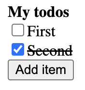

# Todo

Can't have a component system without making a todo app!

Exploration of structuring a todo app with multiple components, and how to control a state of HTML nodes (todo items) and passing them to another component.

This project was comprised of two phases:

1. `2-todo/index.html` - initial exploration of todo app structure
2. `2-todo/app` - extracted patterns into a runtime, and introduced a method for binding data into DOM

## Data binding

After mounting, any `data[value]` elements in the component's shadow DOM is bound to a value on the component instance referenced by the `value` attribute. _my-app.html_ uses `<data value="items" />` to inject the `items` element list defined in _my-app.js_.
