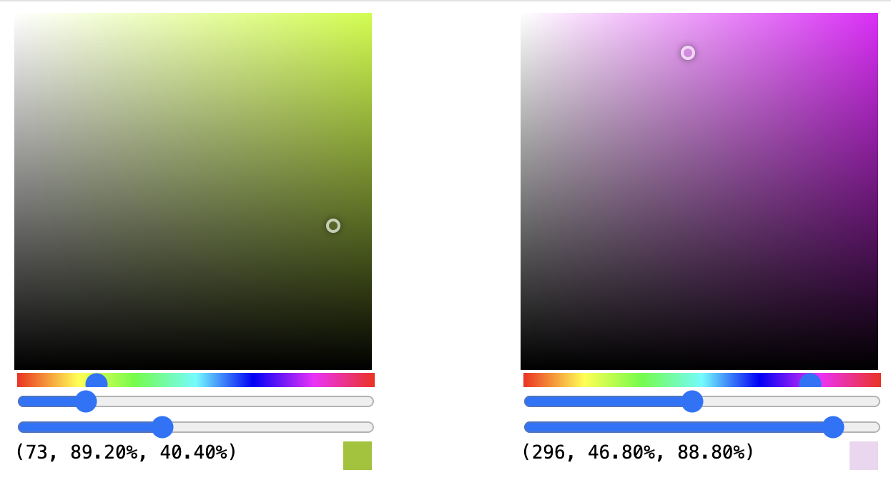

# Colorpicker



Adding the ability to pass (primitive) state values as attributes. The three states - `hue`, `saturation`, and `lightness` - are used to render the selected color, show where it is in the color space, provide the HSL values, and allow the user to change the color.

```html
<script>
	this.hue = new DataConnection(240);
	this.saturation = new DataConnection(100);
	this.lightness = new DataConnection(50);

	const updateHue = (hue) => {
		this.hue.value = hue;
		this.shadowRoot.getElementById("colorBg").style.backgroundColor = `hsl(${hue}, 100%, 50%)`;
	};

	const updateSaturation = (saturation) => {
		this.saturation.value = saturation;
	};

	const updateLightness = (lightness) => {
		this.lightness.value = lightness;
	};

	const updateColor = () => {
		const indicator = this.shadowRoot.getElementById("colorIndicator");
		indicator.style.left = `${this.saturation.value}%`;
		indicator.style.top = `${100 - this.lightness.value}%`;

		this.shadowRoot.getElementById("colorResult").style.backgroundColor = `hsl(${this.hue.value}, ${this.saturation.value}%, ${this.lightness.value}%)`;
	};
	this.hue.onUpdate(updateColor);
	this.saturation.onUpdate(updateColor);
	this.lightness.onUpdate(updateColor);

	const getValuesFromClickEvent = (e) => {
		const saturation = (e.offsetX / e.target.clientWidth) * 100;
		const lightness = 100 - (e.offsetY / e.target.clientHeight) * 100;
		this.saturation.value = saturation.toFixed(2);
		this.lightness.value = lightness.toFixed(2);
	};

	this.html = component`
  <div class="colorpicker">
    <section id="colorBg" class="colorBox" onclick=${getValuesFromClickEvent}>
      <div class="saturationBg"></div>
      <div class="lightnessBg"></div>
      <div id="colorIndicator"></div>
    </section>
    <section class="values">
      <input type="range" min="0" max="360" class="hueSlider" value=${this.hue} onchange=${(e) => updateHue(parseFloat(e.target.value))} />
      <input type="range" min="0" max="100" class="saturationSlider" value=${this.saturation} onchange=${(e) => updateSaturation(parseFloat(e.target.value))} />
      <input type="range" min="0" max="100" class="lightnessSlider" value=${this.lightness} onchange=${(e) => updateLightness(parseFloat(e.target.value))} />
    </section>
    <section id="result">
      (${this.hue}, ${this.saturation}%, ${this.lightness}%)
      <div id="colorResult"></div>
    </section>
  </div>
`;
</script>
```
