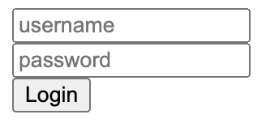

# Login



### Component template

While the augmented HTML format hasn't changed, how to use it has. The tagged template literal is renamed to `render` and there is no more `this.html` that needs to be set.

#### was

```js
this.html = component`<div>...<div>`;
```

#### now

```js
render`<div>...<div>`;
```

### Attributes

Added the ability to provide non-primitive values as attributes to other custom components (which use the same runtime), and an automation for reading attributes. The `attributes` variable is a map provided to the HTML `script` exposing attributes as `DataConnection` instances.

In keeping with the web component spec, all attributes must be defined on the class as a static `observedAttributes` array.

Attributes in this form allow two-way binding, as demonstrated in _login-input.html_ which sets the attribute's value on change:

```html
<script>
	render`
		<input type=${attributes.type} value=${attributes.value} placeholder=${attributes.placeholder} onchange=${(e) => {
		attributes.value = e.target.value;
	}} />
`;
</script>
```

```js
customElements.define(
	"login-input",
	class LoginInput extends BaseLoginInputElement {
		static observedAttributes = ["value", "type", "placeholder"];
	}
);
```
