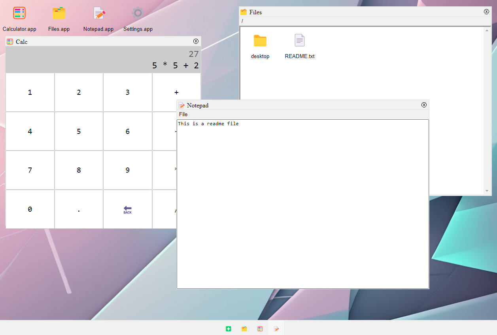

# Desktop

Moved runtime into an importable module instead of global script.

Added `element` tagged template literal to easily create an element with the same syntax as `render`.

Components get a `refs` object automatically mapping IDs to the corresponding elements.

Better event handling, including support for custom events. Handlers no longer pollute the global scope

A component's `attributes` object now auto-populates a value when accessed

Renamed `State` to `Signal` to match the zeitgeist

Introduced `Signal#as` to map values without losing reactivity

Introduced `Signal::with` to map multiple values without losing reactivity

Introduced `ConnectedNode` to better manage value rendering into DOM locations

Interpolated attributes with "true", "false" and truthy/falsy values are handled correctly

## Challenges to solve

- `registerComponent`'s class extending is backwards
- when attribute values are enclosed in quotes - `element

` - it isn't handled as an attribute
