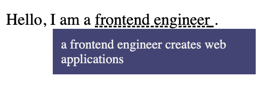
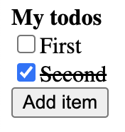

Exploratory component based architecture using web components

#### customized built-in elements

Currently only autonomous custom elements are supported, but this prevents doing things like extending `HTMLInputElement` with custom functionality.

## Usage

### Creating elements

Browser DOM APIs are powerful but overly often too verbose to understand at a glance. This library provides an `element` tagged template literal to make creating DOM much easier.

```javascript
import {element, Signal} from './6-desktop/runtime.js';

const counter = new Signal(0);
const app = element`
  <div>
    <button onclick=${() => counter.value += 1}>increment</button>
    <button onclick=${() => counter.value = 0}>reset</button>
    <span>${counter}</span>
  </div>
`;
document.body.appendChild(app);
```

### Declaring web components

Components are defined by importing and calling `registerComponent`. The callback method receives some special values:

* `render` - a tagged template literal that takes augmented HTML and renders it as the component body
* `attributes` - an object exposing any attributes passed into the component, supports destructuring & forwarding
* `refs` - an object of references to elements with an id in the component body
* `element` - the instance of the component

```javascript
import { registerComponent } from './6-desktop/runtime.js';
registerComponent('my-component', ({ render, attributes, refs }) => {
  const { type, ...rest } = attributes;
  render`
    <style>
    /* styles only affect DOM from this component */
    input { /* ... */ }
    </style>
    <div id="container" ${rest}>
      <input id="input" type=${attributes.type} />
      <button onclick=${() => refs.input.value = ''}>clear</button>
    </div>
  `;
});
```

### State

Local component state is stored in `State` objects. These are subscribable values that can be read and written to, and can be passed directly into parts of the DOM string.

```javascript
import {Signal} from './6-desktop/runtime.js';

registerComponent('value-incrementer', ({render}) => {
  // declare a local state value
  const counter = new Signal({count: 0});

  // render the value in the DOM and also pass it to a hidden input's value 
  render`
    <div>
      <button onclick=${() => counter.value += 1}>increment</button>
      <span>${counter}</span>
      <input type="hidden" value=${counter} />
    </div>
  `;

  // respond to state changes if needed
  counter.onUpdate(value => console.log(`counter is now ${value}`));
});
```

### Sharing state

State objects can be declared outside of a component definition and consumed in the same way,

```javascript
import {Signal} from './6-desktop/runtime.js';

// declare a state value that all value-incrementer components will share
// alternatively, this could be defined in a separate file and imported
const counter = new Signal({count: 0});

registerComponent('value-incrementer', ({render}) => {
  // render the value in the DOM and also pass it to a hidden input's value 
  render`
    <div>
      <button onclick=${() => counter.value += 1}>increment</button>
      <span>${counter}</span>
      <input type="hidden" value=${counter} />
    </div>
  `;

  // respond to state changes if needed
  counter.onUpdate(value => console.log(`counter is now ${value}`));
});
```

### Events

Events can be emitted by calling `this.emit(event_name, event_value)` from either the HTML or JS contexts. The final event name will be `${component_name}-${event_name}`.

## Best practices

- prefer slots over attributes when passing DOM content

## Architecture decisions

- because indentation whitespace is reflected in rendered HTML
  - `html` trims whitespace at the beginning and end of lines
  - component html has leading & trailing whitespace removed from each line
- `ContainedNodeArray` manages an array of nodes without a wrapping element
- `State` a subscribable state value
- `ConnectedNode` created to manage rendering and updating one or more values to a DOM location
- incoming attributes are mapped to an internal `State` instance
  - provides consistent way to interact with attributes: always a subscribable value
  - all state, including attributes, is writable; currently this allows setting an attribute from the consuming component, effectively providing two-way binding

## Iterations

### 1-tooltip



Initial exploration of creating a web component, particularly slots and styles with shadow dom.

### 2-todo



This project was comprised of two passes:

The first pass (`2-todo/index.html`) used the basic structure of a todo app to find component boundaries and how slotted content could be maintained. This also explored maintaining a stateful list of nodes and rendering them to the DOM.

The second pass (`2-todo/app`) extracted patterns into a runtime.

### 3-calc


The intent of the calculator app was to explore events and state management while also moving to a more developer-friendly way of authoring component structure.

### 4-colorpicker


Explores how attributes with primitive values can be provided. Further validation of state values by chaining them for computed values and using one across multiple UI locations.

### 5-login


Continuing the exploration of attributes, this added the ability to pass values (including non-primitives) between components.

### 6-desktop


Fully fledged project to re-evaluate the architecture and patterns that have emerged, with a strong focus on DX.

* Moved runtime into an importable module instead of global script.
* Added `element` tagged template literal to easily create an element with the same syntax as `render`.
* Components get a `refs` object automatically mapping IDs to the corresponding elements.
* Better event handling, including support for custom events. Handlers no longer pollute the global scope
* Improved state value usage with `as` and `with` methods
* Introduced `ConnectedNode` to properly manage value rendering into DOM locations.
