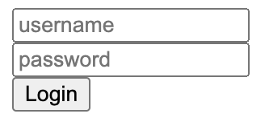

Exploratory component based architecture using web components

### To explore

#### `renderable`

Right now there is code in place that handles mounting/rendering/updating `DataConnection` and to a much smaller extent, `ContainedNodeArray`. This is a bit of a mess and should be cleaned up, likely finding a `renderable` abstraction that both can opt into.

#### easier state

`DataConnection` tried to be a bit too magical and should be easier to reason about. It's unclear when you need to interact with its `value` property and if you do so in the wrong place it breaks the reactivity.

#### customized built-in elements

Currently only autonomous custom elements are supported, but this prevents doing things like extending `HTMLInputElement` with custom functionality.

## How to use

- load `runtime.js` (from `5-login` for latest)
- call `loadComponents('my-app', 'todo-item', 'todo-list');` with each of your component names

> [!NOTE]  
> For DX, a lot of capability has been added to the HTML environment and can be used to build interactions instead of adding to the class definition itself.
>
> The JS file should be used to define additional functionality or heavy lifting for the component to use, and to define any API another component could interact with.

### Definining a component

A component can be comprised from three files: HTML, CSS, and JS. Only the HTML file is required. Calling `loadComponents` automatically loads any existing files for each component.

Let's build `<my-component>`

#### HTML

```html
<div class="myComponent"></div>
```

The HTML file can also start with a `<script>` tag which will be executed in a special context whenever the component is instanced. This method is comparable to React function components.

The context is provided these values:

| Variable     | Description                                                                            |
| ------------ | -------------------------------------------------------------------------------------- |
| `this`       | the component instance                                                                 |
| `attributes` | an object exposing any attributes passed into the component                            |
| `render`     | tagged template literal that takes augmented HTML and renders it as the component body |

The augmented HTML format allows callbacks, DOM output, and attributes to be specified as expressions. The following example is a button with a value that increases when clicked:

```html
<script>
	const count = new DataConnection(0);
	const increment = () => (count.value += 1);
	render`<button type=${attributes.type} onclick=${increment}>${count}</button>`;
</script>
```

Callbacks can also be passed inline:

```html
<script>
	const count = new DataConnection(0);
	render`<button type=${attributes.type} onclick=${() => (count.value += 1)}>${count}</button>`;
</script>
```

#### CSS

```css
.myComponent {
	/* styles */
}
```

#### JS

> [!IMPORTANT]  
> **if present, this file is responsible for calling `customElements.define`, otherwise `loadComponents` handles the definition**

`loadComponents` creates a base class you can extend, named `Base${ComponentName}Element`. This class provides the component runtime functionality

In fitting with standard web component usage, attributes you want to observe should be defined in a static `observedAttributes` array.

```js
customElements.define(
	"my-component",
	class MyComponent extends BaseMyComponentElement {
		static observedAttributes = ["value", "type", "placeholder"];

		constructor() {
			super();
		}
	}
);
```

### Events

Events can be emitted by calling `this.emit(event_name, event_value)` from either the HTML or JS contexts. The final event name will be `${component_name}-${event_name}`.

## Best practices

- prefer slots over attributes when passing DOM content

## Architecture decisions

- because indentation whitespace is reflected in rendered HTML
  - `html` trims whitespace at the beginning and end of lines
  - component html has leading & trailing whitespace removed from each line
- `ContainedNodeArray` manages an array of nodes without a wrapping element
- `DataConnection` a subscribable state value
- incoming attributes are mapped to an internal `DataConnection` instance
  - provides consistent way to interact with attributes: always a subscribable value
  - all state, including attributes, is writable; currently this allows setting an attribute from the consuming component, effectively providing two-way binding
- component class code goes in JS file
- component instance code goes in HTML file
  - `script` tags added via `innerHTML` are not executed, allowing for a safe way to include JS in the HTML file without it being executed globally, instead later called by the runtime with component context

## Iterations

### 1-tooltip


Initial exploration of creating a web component, particularly slots and styles with shadow dom.

### 2-todo


This project was comprised of two passes:

The first pass (`2-todo/index.html`) used the basic structure of a todo app to find component boundaries and how slotted content could be maintained. This also explored maintaining a stateful list of nodes and rendering them to the DOM.

The second pass (`2-todo/app`) extracted patterns into a runtime.

### 3-calc


The intent of the calculator app was to explore events and state management while also moving to a more developer-friendly way of authoring component structure.

### 4-colorpicker


Explores how attributes with primitive values can be provided. Further validation of state values by chaining them for computed values and using one across multiple UI locations.

### 5-login



Continuing the exploration of attributes, this added the ability to pass values (including non-primitives) between components.

```

```
